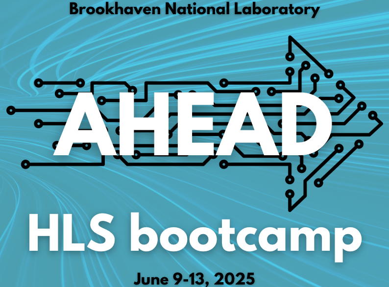

<table class="sphinxhide" width="100%">
 <tr>
   <td align="center"><h1>Vitis™ Example Tutorials</h1>
   </td>
 </tr>
 <tr>
 <td>
 </td>
 </tr>
</table
# AHEAD Example Project: Vector Addition

Welcome to the AHEAD workshop! This section walks you through setting up and cloning the example project used in the hands-on sessions.

---

## 🔧 Environment Setup

### 1. Open a terminal in your desired workspace location:
> (Right-click → **"Open Terminal Here"**)

```bash
cd ~
```

### 2. Source the Xilinx environment

Depending on the machine you're using, run the appropriate commands below.

#### 🔹 If you're on `130.199.21.151`:

```bash
source /tools/Xilinx/Vitis/2024.2/settings64.sh
source /opt/xilinx/xrt/setup.sh
```

#### 🔹 If you're on `haiderbnldesktop`:

```bash
source /media/slowSSD/Xilinx_2024.1/Vitis/2024.1/settings64.sh
source /opt/xilinx/xrt/setup.sh
```

---

## 📂 Project Checkout

### 3. Create a working directory for AHEAD projects:

```bash
mkdir -p ~/AHEAD
cd ~/AHEAD
```

### 4. Clone the example repository:

```bash
git clone https://github.com/AkshayMalige/AHEAD_2025.git
```

You are now ready to begin working on the example vector addition project.

---

🔁 *Next step: Open the project in Vitis Unified or Classic GUI and follow the component build instructions in Part 2.*
