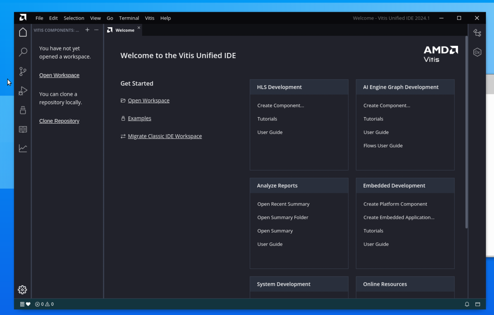
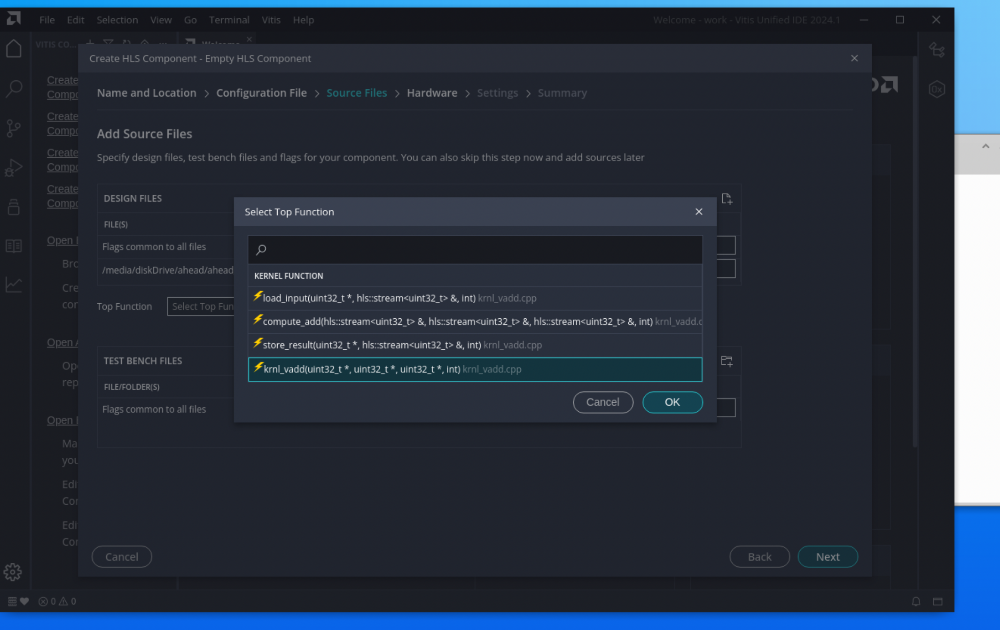
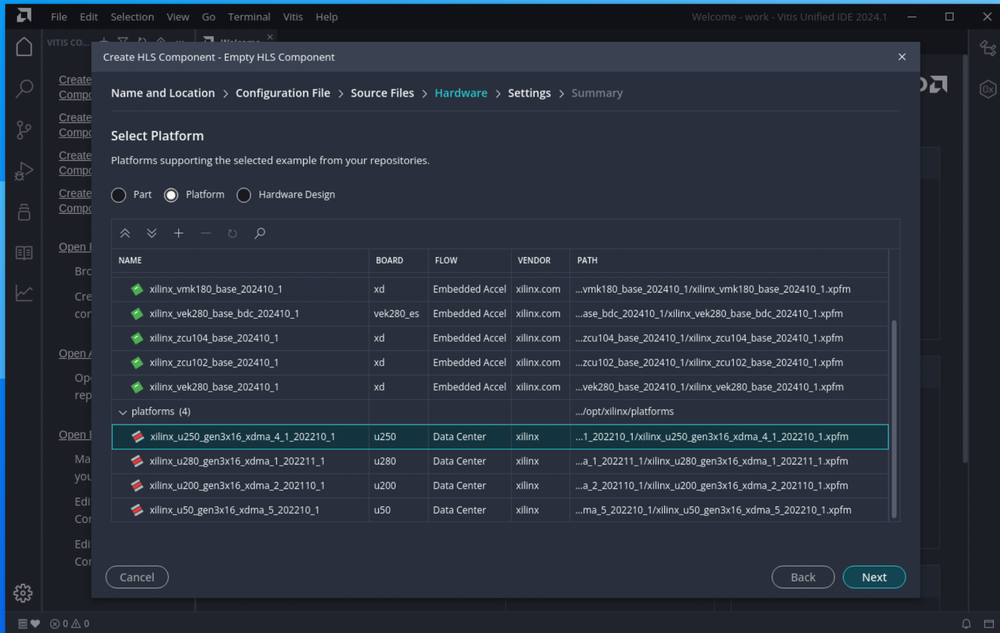
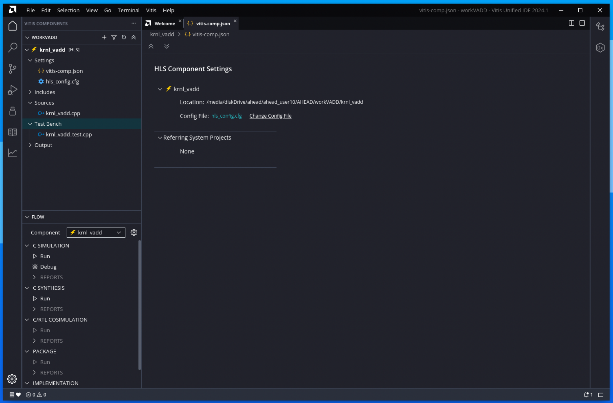
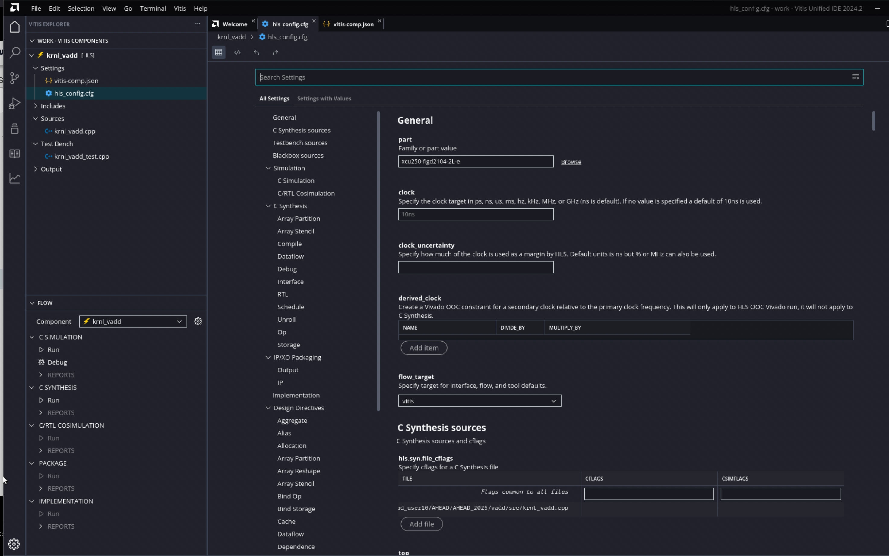
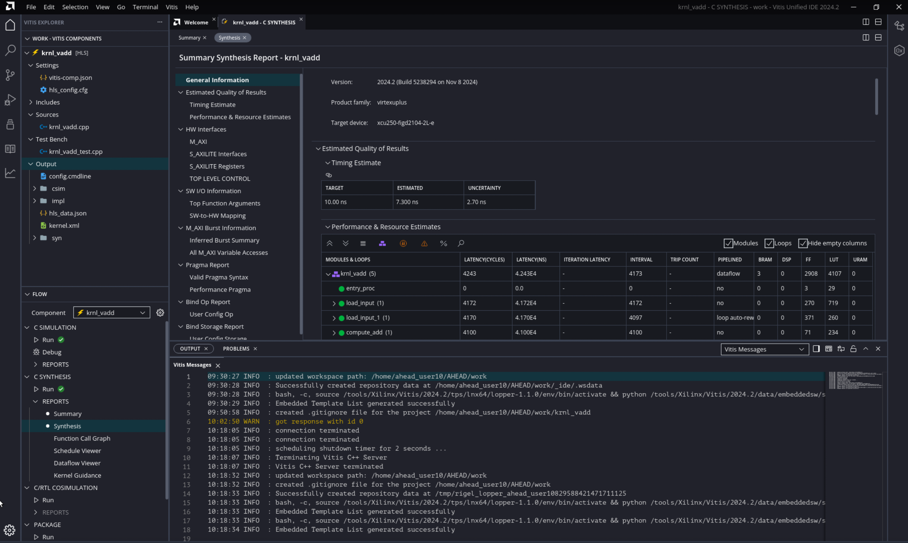
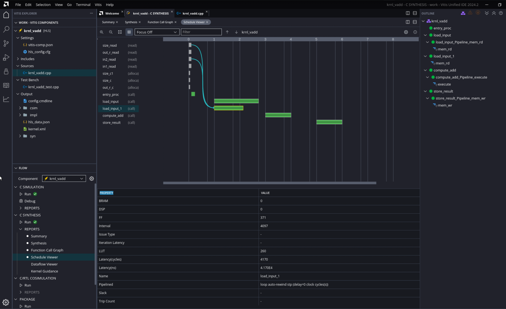

<table class="sphinxhide" width="100%">
  <tr>
    <td align="center">
      <h1>Vitis™ Example Tutorial</h1>
    </td>
  </tr>
  <tr>
    <td></td>
  </tr>
</table>

# 🚀 AHEAD Example Project

Welcome to the AHEAD workshop! Follow this clear, step-by-step guide for the example vector addition project.

# Vitis Getting Started Tutorial

This lab introduces the new **Vitis unified IDE** as described in [Introduction to Vitis unified IDE](https://docs.amd.com/access/sources/dita/topic?Doc_Version=2024.1%20English&url=ug1393-vitis-application-acceleration&resourceid=svk1630656618393.html). The unified IDE provides a single tool for end-to-end application development, without the need to jump between multiple tools for design, debug, integration, and analysis.

> **NOTE:** The following text assumes you have set up the environment as instructed in [Part 2: Environment Setup](./part2.md).

---

## Launch the Vitis unified IDE

The first step is to create a workspace for your project and to launch the Vitis unified IDE using the following steps:

1. `mkdir work`
2. `vitis -w work`


   The Vitis Unified IDE opens the specified workspace displaying the Welcome page. The workspace is a folder for holding the various components and projects of a design.

   


### Creating the HLS Component 

Use the **File > New Component > HLS** to create a new HLS component. This opens the Create HLS Component wizard to the *Name and Location* page. 

1. For the **Component name** field specify `krnl_vadd` 
2. For the **Component location** specify the workspace which is the default value
3. Click Next to open the *Configuration File* page.
   

The *Configuration File* lets you specify commands for building and running the HLS component as described in [*HLS Config File Commands*](https://docs.amd.com/access/sources/dita/topic?Doc_Version=2024.1%20English&url=ug1399-vitis-hls&resourceid=azw1690243984459.html). You can specify a new empty file, an existing config file, or generate a config file from an existing HLS project as described in [*Creating an HLS Component*](https://docs.amd.com/access/sources/dita/topic?Doc_Version=2024.1%20English&url=ug1399-vitis-hls&resourceid=yzz1661583719823.html).

4.  Select **Empty File** and click **Next**. 

This opens the *Source Files* page. 

5.  Select the **Add Files** icon to open a file browser, navigate to `<downloaded_git_repo_path>/AHEAD/AHEAD_2025/vadd/src/krnl_vadd.cpp` and select **Open** to add the **kernel design** file. 

6.  Under the Top Function browse and select the `krnl_vadd` function and click **OK**.
   
8.  Select the **Add Files** icon to open a file browser, navigate to `<downloaded_git_repo_path>/AHEAD/AHEAD_2025/vadd/src/krnl_vadd_test.cpp` and select **Open** to add the **Test Bench** file. 
9. Click **Next** to open the the *Select Part* page.
10. Select **Platform**, select the `xilinx_u250_gen3x16_xdma_4_1_202210_1` platform and click **Next** to open the *Settings* page.

    

12.  On the *Settings* page specify `8ns` for the **clock**, and `12%` for the **clock_uncertainty** to override the default values.
13.  For **flow_target** select the `Vitis Kernel Flow` 
14. For **package.output.format** specify `Generate a Vitis XO` to create .xo output`. 

The default clock uncertainty, when it is not specified, is 27% of the clock period. For more information, refer to [Specifying the Clock Frequency](https://docs.amd.com/access/sources/dita/topic?Doc_Version=2024.1%20English&url=ug1399-vitis-hls&resourceid=ycw1585572210561.html)

13. Click **Next** to open the *Summary* page. Review the *Summary* page and click **Finish** to create the defined HLS component.

    

In the Vitis Components Explorer you can see the `krnl_vadd` component created, with the `vitis-comp.json` file opened in the center editor. You can see the `hls-config.cfg` file which is where the build directives will be placed to control the simulation and synthesis process. 

The Flow Navigator displays the `krnl_vadd` component as the active component, and shows the flow for designing the HLS component including C Simulation, C Synthesis, C/RTL Co-simuation, and Implementation.

One advantage of the unified Vitis IDE is the ability to work from the bottom-up, building your HLS or AIE components and then integrating them into a higher-level system project. 
The HLS component is created and opened as shown in the figure below.

### Building and Running the HLS Component.

With the HLS Component as the active element in the Flow Navigator, you can see there are three different build targets as described below: 
* Software Emulation: The kernel code and host application are compiled to run on the X86 processor rather than the embedded processor of the platform. The new Vitis unified IDE uses the PS on X86 emulation flow as previously discussed. The software emulation target allows quick iterative algorithm refinement through fast build-and-run loops. This target is useful for identifying syntax errors, performing source-level debugging of the kernel code running together with application, and verifying the behavior of the system. 
* Hardware Emulation: The kernel code is compiled into a hardware model (RTL), which is run in the Vivado logic simulator. The host application runs on an emulation environment (QEMU) version of the embedded processor. This build-and-run loop takes longer but provides a detailed, cycle-accurate view of kernel activity. This target is useful for testing the functionality of the logic that will go into the Programmable Logic (PL) region of the device and getting initial performance estimates. 
* Hardware: The kernel code is compiled into a hardware model (RTL) and then implemented on the device, resulting in a binary that will run on the actual hardware.

Here, you will walk through the Hardware Emulation build as an exercise in building and running the system.  

## Run the C Simulation

You can see the General settings of the dct component reflect the part, clock and flow_target settings you specified when creating the HLS component. Scroll down and you can see the C Synthesis sources and Testbench sources you added as well.

  1. On the left, select the C Simulation category.
  2. Review the various simulation settings.



Look at the Flow Navigator with the krnl_vadd component active. It displays the C Simulation step, C Synthesis, C/RTL Co-simulation, and Implementation as the primary steps of the HLS component workflow.

  1. Click Run under C SIMULATION. (if asked click "Yes, enable Code Analyzer")

The Output window is displayed in the console area, and the krnl_vadd::c_simulation transcript is displayed. You can review the transcript as simulation occurs. Also review the reports like "Code Analyzer"

You are ready to run C Simulation on the project, but first you can configure the simulation by editing the hls_config.cfg file.

In the open vitis-comp.json for the krnl_vadd component click the hls_config.cfg link to open the Configuration Editor. On the left is a list of categories for configuring the HLS component, and on the right are the various configuration options


## Run C Synthesis

  1. After simulation completes, click *Run* under C Synthesis.

The default output format for C synthesis is RTL. This is to let you evaluate the results of high-level synthesis before exporting the Vivado IP or Vitis kernel for further use in an embedded system design or Data Center acceleration.

Again, you can view the krnl_vadd::synthesis transcript displayed in the Output window as the design is synthesized. Examine the transcript to see what steps the tool takes during synthesis. The following list describes some of the steps listed:

Project and solution initialization loads source and constraints files, and configures the active solution for synthesis.

  *  Start compilation reads source files into memory.
  *  Interface detection and setup reviews and generates port and block interfaces for the function.
  *  Compiler transforms code to operations.
  * Performs Synthesizeability checks.
  * Automatic pipelining of loops at tripcount threshold.
  * Unrolling loops, both automatic and user-directed.
  * Balance expressions using associative and commutative properties.
  * Loop flattening to reduce loop hierarchy.
  * Partial write detection (writing part of a memory word)
  * Finish architecture synthesis, start scheduling.
  * End scheduling, generate RTL code.
  * Report FMax and loop constraint status.

The Vitis HLS tool also automatically inlines small functions, dissolving the logic into the higher-level calling functions, and pipelines small loops with limited iterations. These features are configurable by user directives in the hls_config.cfg file, or pragmas in the dct.cpp source.

After synthesis completes you will see the Run command marked with a green circle and a checkmark to indicate it has been succesfully run. However it will also have a yellow Caution triangle to indicate that the output.format was RTL and no IP or XO was generated from the design. This output will need to be generated before the HLS component can be used in downstream tools such as the Vivado Design Suite, or in a System project.

After synthesis completes you will also see Reports under C Synthesis is populated with a Summary report, Synthesis, Function Call Graph, Schedule Viewer, Dataflow Viewer (for Dataflow designs), and Kernel Guidance. You can click to view any of these reports.

  1. Open the Synthesis report. This is the Synthesis Summary report that would previously open after synthesis. Now you can access the report when needed.



Look at the top of the Performance and Resource Estimates table in the figure above. It displays a number of icons that enable different features of the report. Also notice the icon on the Timing Report that changes timing from ns to MHz.

Notice that the various sub-functions from the krnl_vadd.cpp source are reported in the synthesis results. This is because the tool has *Not* inlined these functions automatically. You can enable the inlining of specific functions by adding the INLINE OFF pragma or directive for the function, or by adding the DATAFLOW optimization to the design, which you will be doing later in this tutorial.

You can pipeline the loops to have fewer than a specified number of iterations. When pipelining, the tool tries to achieve an II of 1. The II is the number of clock cycles before the next iteration of the loop is processed. When pipelining the loop with II=1, you want the next iteration to start at the next clock cycle. You can pipeline your loops in function "load_input" as follows : 


```cpp
static void load_input(uint32_t* in, hls::stream<uint32_t>& inStream, int size) {
mem_rd:
    for (int i = 0; i < size; i++) {
#pragma HLS PIELINE II=1
#pragma HLS LOOP_TRIPCOUNT min = c_size max = c_size
        inStream << in[i];
    }
}
```

You can read more on HLS pragmas and thier usage [here](https://docs.amd.com/r/en-US/ug1399-vitis-hls/HLS-Pragmas).

## Analyze the Results

In the Flow Navigator, select the Schedule Viewer report.

The left side of the Schedule Viewer lists each operation in chronological order in the synthesized function. It displays the design control steps presented horizontally as a timeline starting at step 0, and running through to completion. You can select operations from the list to view the connections between them.

The default view shows all of the operations. However, a drop-down menu at the top of the Schedule Viewer lets you select specific functions, loops, or elements of the design that are of interest.





### Next Step

Next, learn about using optimization techniques [here](https://docs.amd.com/r/en-US/Vitis-Tutorials-Getting-Started/Using-Optimization-Techniques). Escpesially derivatives like PIPELINE, DATAFLOW, ARRAY_PARTITION and try to use them in your design to study changes in the performance. 

**Click here to [Create Application and System Project](./part5.md)**

