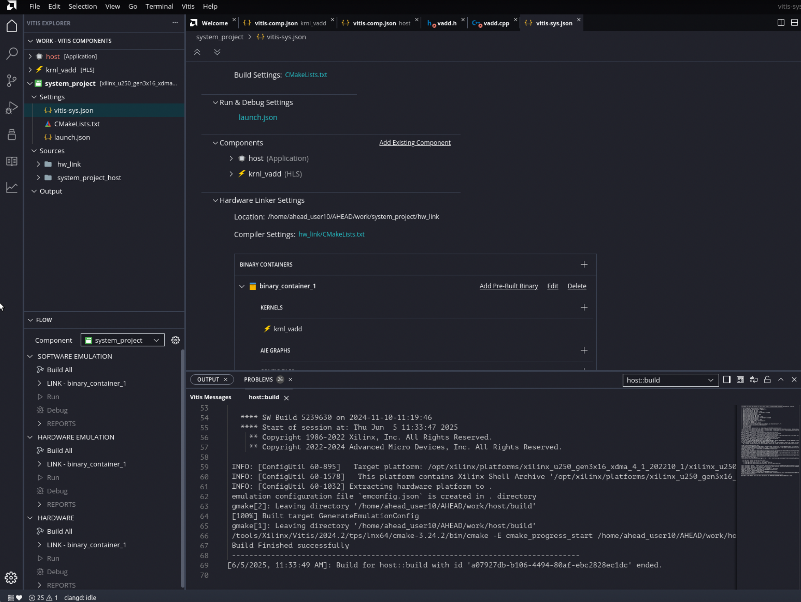

<table class="sphinxhide" width="100%">
  <tr>
    <td align="center">
      <h1>Vitis™ Example Tutorial</h1>
    </td>
  </tr>
  <tr>
    <td></td>
  </tr>
</table>

## Creating Application Component

The Application component is an application that runs on the processor, Arm or x86, that loads and runs the device binary (`.xclbin`) which you will build later. The Vitis unified IDE automatically detects whether the Application component uses XRT native API or OpenCL and compiles the code as needed. Create the Application component using the following steps:

1. From the main menu select **File > New Component > Application**
2. Enter the **Component name** as `host`, and the **Component location** as the workspace (default), then click **Next**.
3. On the *Select Platform* page, choose the `xilinx_u250_gen3x16_xdma_4_1_202210_1` platform.
4. Click the **Add Files** icon and import `vadd.cpp` and `vadd.h` from `<downloaded_git_repo_path>/AHEAD/AHEAD_2025/vadd/src/`
5. Review the *Summary* page and click **Finish**.
6. Once imported, select `vadd.cpp` in the Component Explorer to view it in the Code Editor.
7. Click **Build** to compile for X86 Simulation or Hardware.

## Creating System Project

The System project is where different components are integrated into a complete system.

### Create the System Project

1. Select **File > New Component > System Project**
2. Enter the name as `system_project` and use the default location. Click **Next**.
3. On the *Select Platform* page, choose `xilinx_u250_gen3x16_xdma_4_1_202210_1`, click **Next**, then **Finish**.

> **Tip:** Instructions for downloading and installing platform files can be found [here](https://docs.amd.com/r/en-US/ug1301-getting-started-guide-alveo-accelerator-cards/XRT-and-Deployment-Platform-Installation-Procedures-on-RedHat-and-CentOS)

4. Open the generated `vitis-sys.json`. Scroll to the **Components** section and click **Add Existing Component** to add the HLS and host components.

---

## Building and Running Emulation in the System Project

Once the System project is configured:

### 1. Set Active Build Configuration

Use the top-right dropdown or `vitis-sys.json` editor to select:
- `sw_emu` for software emulation
- `hw_emu` for hardware emulation

### 2. Build the System

In the Flow Navigator:
- Click **Build > Build for Emulation** (target depends on selected configuration)

This runs the `v++ --link` step and builds the `.xclbin` for emulation.

### 3. Run the Emulation

With `system_project` selected, go to **Run > Launch Emulation**.

A terminal appears showing execution logs from your host and emulated kernel.

### 4. Analyze Emulation Reports

After emulation:

#### Open the **Run Summary**:

- Go to **Window > Show View > Run Summary**
- Double-click the latest summary

#### Key Reports:

- **Timeline Trace**: Gantt-style view of memory/kernel activity
- **Profile Summary**: Kernel execution times, throughput, stalls
- **System Estimate**: Estimated LUTs, BRAM, URAM, FF usage

### 5. Next Steps

- If `sw_emu` passes: functional correctness is verified
- If `hw_emu` passes: timing and performance behavior validated

You can now:

- Apply optimizations in HLS (e.g., `PIPELINE`, `DATAFLOW`, `PARTITION`)
- Tune host-kernel interactions
- Switch build to `hardware`, and run **Build > Build for Hardware**

This produces the final `.xclbin` for deployment to the Alveo card.
