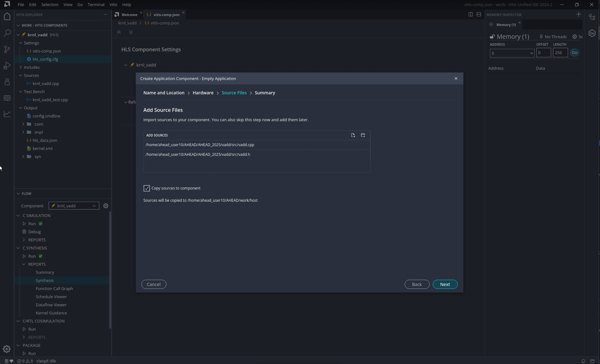

<table class="sphinxhide" width="100%">
  <tr>
    <td align="center">
      <h1>Vitis™ Example Tutorials</h1>
    </td>
  </tr>
  <tr>
    <td></td>
  </tr>
</table>

## Creating Application Component

The Application component is an application that runs on the processor, Arm or x86, that loads and runs the device binary (`.xclbin`) which you will build later. The Vitis unified IDE automatically detects whether the Application component uses XRT native API or OpenCL and compiles the code as needed. Create the Application component using the following steps: 

1.  From the main menu select **File > New Component > Application**

This opens the Create Application Component wizard on the *Name and Location* page. 

2.  Enter the **Component name** as `host`, enter the **Component location** as the workspace (default), and click **Next**. 

This opens the *Select Platform* page. 

3. On the *Select Platform* page select the `xilinx_u250_gen3x16_xdma_4_1_202210_1` platform.
   
4. If you using Vitis 2024.2, Select the **Add Files** icon to open a file browser, navigate to `<downloaded_git_repo_path>/AHEAD/AHEAD_2025/vadd/src/vadd.cpp` and select **Open** to add the **kernel design** files. Also add vadd.h as shown below. If you are using Vitis 2024.1 (haiderbnldesktop), In the Components Explorer view expand the `host` component, right-click the `Sources` folder and **Import > Files** to import the following source file: `<downloaded_git_repo_path>/AHEAD/AHEAD_2025/vadd/src/vadd.cpp`

6.  Review the *Summary* page and click **Finish** to create the defined Application component. 
 
The Application component `vitis-comp.json` file is opened in the center editor, and the component is added to the Component Explorer. When creating the Application component you do not specify source files so you must add the required source files after the component is created. 

After adding it, you can select the `vadd.cpp` and  `vadd.h` file in the Vitis Components Explorer to open it in the Code Editor in the central editor window. This example shows the simplest way of using OCL API to interact with the hardware accelerator.
 
Having added the source code to the component, you are now ready to compile the code. Looking at the Flow Navigator with the Application component the active component, you can see there are Build commands under X86 Simulation and Hardware. For Data Center applications, these two are essentially the same as the Application component runs on the X86 processor for both Hardware and Emulation. However, for Embedded Processor-based platforms, these are two different build configurations. For software emulation, even though the platform uses an embedded processor, emulation is run on the x86 processor as described in [*Embedded Processor Emulation Using PS on x86*](https://docs.amd.com/access/sources/dita/topic?Doc_Version=2024.1%20English&url=ug1393-vitis-application-acceleration&resourceid=vfp1662765605490.html). For hardware emulation, or to run on hardware, the Application component must be compiled for the embedded processor domain. These Build choices reflect that requirement. 

6. After the `host.cpp` is imported, click the **Build** command to build the application for X86 Simulation or for Hardware.
